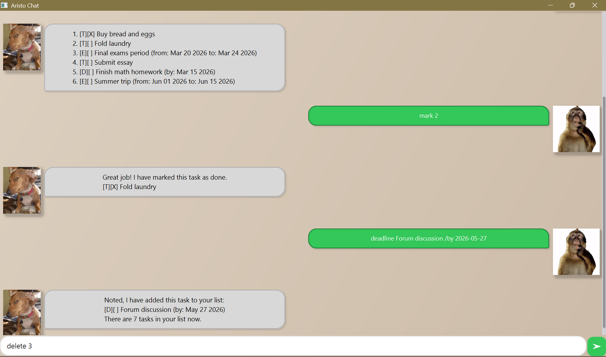

# Aristo User Guide



Aristo is a simple chatbot to help users manage and track their tasks efficiently.

## Features
- Add different types of tasks (Todo, Deadline, Event)
- View your list of active tasks
- Mark and unmark tasks on your list
- Delete tasks from your list
- Find a task through matching keywords
- View active tasks on a given date


## Commands

> **Note:** All dates in Aristo commands should be entered in the `YYYY-MM-DD` format.

These are all the recognised commands. 
- `list` 
- `mark`
- `unmark`
- `todo`
- `deadline`
- `event`
- `delete`
- `find`
- `schedule`
- `bye`

Details for each command are provided below.

### `list`

Lists all tasks in your task list.

**Format:** `list`

Example output:
```
1. [T][X] Buy bread and eggs
2. [E][ ] Final exams period (from: Mar 20 2026 to: Mar 24 2026)
3. [D][ ] Forum discussion (by: May 27 2026)
```

### `mark`

Marks a task as done.

Tasks are marked using `X`.

**Format:** `mark <task index number>`

Example input: `mark 3`

Example output:
```
Great job! I have marked this task as done.
[D][X] Forum discussion (by: May 27 2026)
```

### `unmark`

Marks a task as **not** done yet.

**Format:** `unmark <task index number>`

Example input: `unmark 1`

Example output:
```
Alright, I have marked this task as not done yet.
[T][ ] Buy bread and eggs
```

### `todo`

Adds a Todo task to your list.

**Format:** `todo <task description>`

Example input: `todo Clean my room`

Example output:
```
Noted, I have added this task to your list:
[T][ ] Clean my room
There are 8 tasks in your list now.
```

### `deadline`

Adds a Deadline task to your list.

Deadline tasks come with a 'by' date.

**Format:** `deadline <task description> /by YYYY-MM-DD`

Example input: `deadline Submit assignment /by 2026-03-10`

Example output:
```
Noted, I have added this task to your list:
[D][ ] Submit assignment (by: Mar 10 2026)
There are 10 tasks in your list now.
```

### `event`

Adds an Event task to your list.

Event tasks come with 'from' and 'to' dates.

**Format:** `event <task description> /from YYYY-MM-DD /to YYYY-MM-DD`

Example input: `event Trip /from 2026-01-02 /to 2026-01-09`

Example output:
```
Noted, I have added this task to your list:
[E][ ] Trip (from: Jan 02 2026 to: Jan 09 2026)
There are 11 tasks in your list now.
```

### `delete`

Deletes a task from your list.

**Format:** `delete <task index number>`

Example input: `delete 6`

Example output:
```
Okay, I have removed this task from your list:
[E][ ] Trip (from: Jan 02 2026 to: Jan 09 2026)
There are 10 tasks in your list now.
```

### `find`

Lists tasks matching a given keyword.

**Format:** `find <case-sensitive keyword>`

Example input: `find Buy`

Example output:
```
Here are the matching tasks in your list:
1. [T][X] Buy bread and eggs
2. [T][ ] Buy books
```

### `schedule`

Displays all Deadline tasks due on the given date and all Event tasks occurring on that date.

**Format:** `schedule YYYY-MM-DD`

Example input: `schedule 2026-03-23`

Example output:
```
Here are the tasks scheduled on 2026-03-23:
1. [E][X] Final exams period (from: Mar 20 2026 to: Mar 24 2026)
2. [D][ ] Finish quiz (by: Mar 23 2026)
```

### `bye`

Says goodbye and exits.

**Format:** `bye`

Output:
```
Goodbye!
Aristo eagerly awaits your return...
```